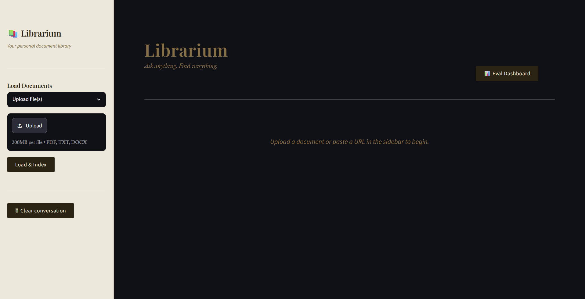
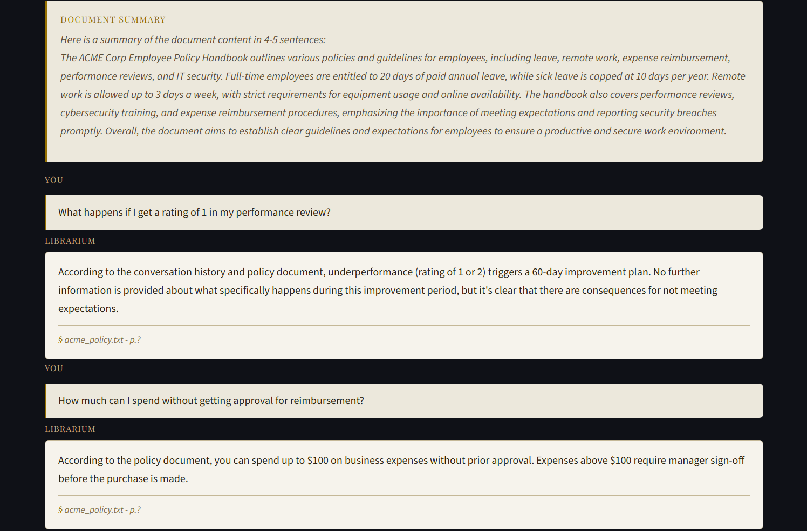
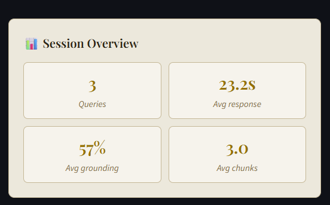
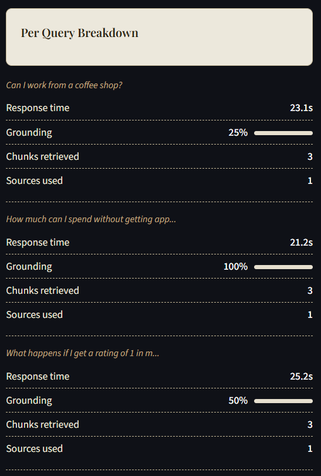

<div align="center">

# Librarium

### A local RAG-based Document Q&A system

*Chat with your documents. Runs fully offline. Zero API costs.*


</div>

---

## Overview

**Librarium** is a fully offline document Q&A system built on a RAG (Retrieval-Augmented Generation) pipeline. Upload PDFs, Word docs, text files, or paste any URL — then ask questions in plain English and get accurate, cited answers powered by a local LLM.

No API keys. No cloud dependency. No cost.

---

## Preview






---

## Features

| Feature | Description |
|---|---|
| **Hybrid Search** | Combines BM25 keyword search and vector search for better retrieval |
| **Multi-format Support** | PDF, DOCX, TXT, and web URLs |
| **OCR** | Extracts text from image-based and scanned PDFs automatically |
| **Conversation Memory** | Ask follow-up questions — the system remembers context |
| **Citations** | Every answer shows the exact source file and page number |
| **Query Rewriting** | Vague questions are automatically rewritten for better retrieval |
| **Auto Summary** | Generates a document summary on load |
| **URL Support** | Fetch and index any webpage mid-session |
| **Chat Export** | Export your Q&A session as a formatted PDF |
| **Eval Dashboard** | Live grounding score, response time, and retrieval stats per query |
| **Streaming** | Answers stream word-by-word for a responsive feel |
| **Persistent Storage** | Vector DB saves to disk and reloads instantly on future runs |

---

## Tech Stack

| Layer | Technology |
|---|---|
| **Orchestration** | LangChain |
| **LLM** | Ollama (llama3.2, llama3.2:1b) — runs locally |
| **Embeddings** | Ollama (nomic-embed-text) |
| **Vector DB** | ChromaDB |
| **Keyword Search** | BM25 (rank-bm25) |
| **OCR** | Tesseract + pdf2image |
| **Web Scraping** | BeautifulSoup + Requests |
| **UI** | Streamlit |

---

## Setup

### Prerequisites

- Python 3.10+
- [Ollama](https://ollama.com) installed and running
- [Tesseract OCR](https://github.com/UB-Mannheim/tesseract/wiki) (Windows installer)
- [Poppler](https://github.com/oschwartz10612/poppler-windows/releases) (Windows)

### Installation

**1. Clone the repository**
```bash
git clone https://github.com/keya115251/document-qna.git
cd document-qna
```

**2. Create and activate a virtual environment**
```bash
python -m venv venv
venv\Scripts\activate       # Windows
source venv/bin/activate    # Mac/Linux
```

**3. Install dependencies**
```bash
pip install -r requirements.txt
```

**4. Pull the Ollama models**
```bash
ollama pull llama3.2
ollama pull llama3.2:1b
ollama pull nomic-embed-text
```

**5. Update paths in `app.py`**
```python
TESSERACT_PATH = r"C:\Program Files\Tesseract-OCR\tesseract.exe"
POPPLER_PATH   = r"C:\poppler\poppler-26.02.0\Library\bin"
```

**6. Run**
```bash
streamlit run app.py
```

---

## Usage

- Upload a PDF, DOCX, or TXT file via the sidebar
- Or paste any URL to index a webpage
- Ask questions in the chat input
- Type `load url <url>` in chat to add more sources mid-session
- Toggle the Eval Dashboard to see retrieval metrics
- Export your session as a PDF from the sidebar

---

## Roadmap

- [x] Hybrid search (BM25 + vector)
- [x] Multi-document support
- [x] OCR for image-based PDFs
- [x] Query rewriting
- [x] Citations with source and page attribution
- [x] Conversation memory
- [x] URL support with mid-session loading
- [x] Auto document summary
- [x] Chat history export as PDF
- [x] Streamlit Web UI
- [x] Evaluation dashboard

---

<div align="center">
<sub>Built by <a href="https://github.com/keya115251">Keya Chembuli</a></sub>
</div>
